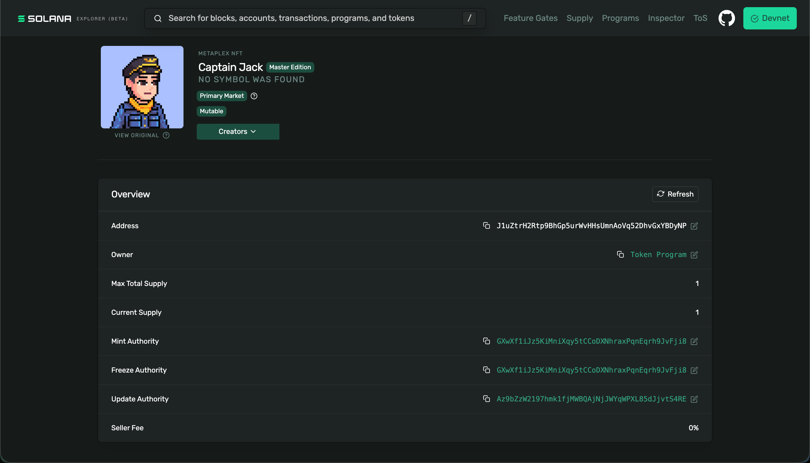

# Q1 26 Structured Pre-Builder

## 3.1 NFTs (Mint and Swap)

### NFT mint - J1uZtrH2Rtp9BhGp5urWvHHsUmnAoVq52DhvGxYBDyNP

[Minting tx](https://explorer.solana.com/tx/hU5Nyrdz6QmiJiPCrjRvbHgDKid54gXTaTQDvArMuZDVtuXTzDTTUYKcTEcTRxTwyV7ZEkY2UyWYGE3aFZ9ReW2?cluster=devnet)

### Reflections

**Problem** 

Trade NFTs in Discord requires to be pending about a reply also if a NFT is popular I could get lost with tons of messages, is not really convenient, also I need to trust the other user (buyer) to send me the SOL I want

**Solution**

A platform can be built to post NFTs and let users to bet on it so I can set the min SOL I want in order to sell my NFT, this proccess is automatized 